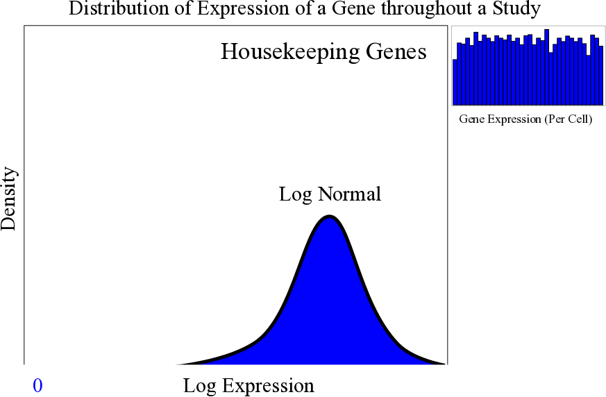
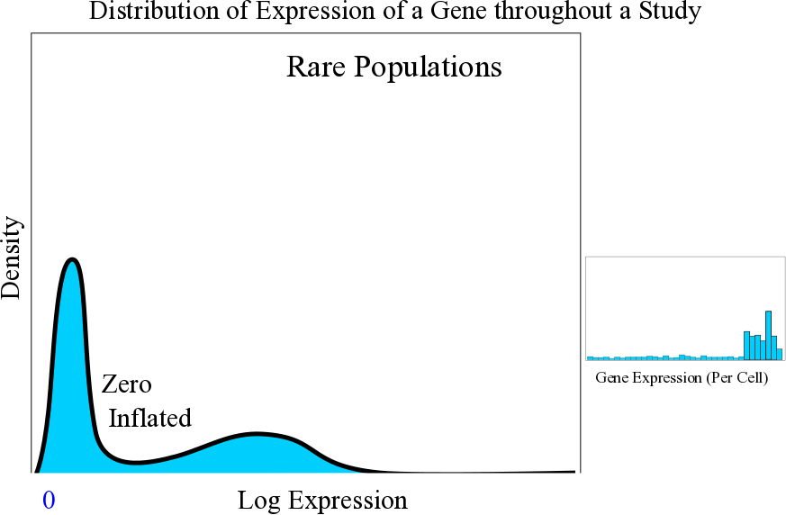
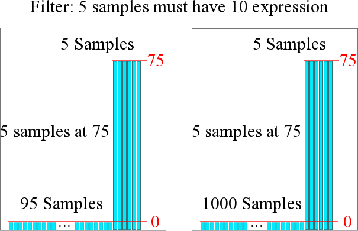

Single-cell RNA-Seq Analysis
========================================================
author: Timothy Tickle and Brian Haas
css: single_cell_analysis.css
date: October 1, 2015

Before We Get Started
===

- Single-cell analysis is new.
  - Give you a feel for the data.
  - Give you some options to explore.
  - These techniques will grow as the field does.

Before We Get Started
===

- This is VERY hands on.
  - Much can be applied to other analyses.
  - Strengthen those R ninja skills!
  - If you need, cut and pasting is available (cut_and_paste.txt).
  - Complex R is simplified in wrapper functions.
  
---


What We Will Attempt to Cover
===

- Initial data exploration, QC, and filtering.
- Ways to plot genes and cells.
- Finding clusters of cells.
- Performing differential expression.
- Detecting rare cell population.
- Psuedotemporal time-series analysis (time permitting).

RStudio: Getting to Know You
===

Let's take a moment.
- Pull data from online (Github).
  - https://github.com/TimothyTickle/single_cell_analysis
- You can view this presentation on-line.
  - http://rpubs.com/timothyltickle/single_cell_analysis
- Quick overview of RStudio.

Logistics
===
class:small-code


```r
# Load libraries
library(vioplot) # violin plots
library(Seurat) # Data Basics, QC, Spatial
#library(scde) # Differential Expressions
```

Load Code
===
class:small-code


```r
# Source code Helper functions
source(file.path("src", "Modules.R"))
```

Briefly Single-cell RNA-Seq Sequencing
===

[Drop Seq Video Abstract](http://www.sciencedirect.com/science/article/pii/S0092867415005498)


Genes Have Different Distributions
===
class:small-code



Genes Have Different Distributions
===
class:small-code


Genes Have Different Distributions
===
class:small-code



Genes Have Different Distributions
===
class:small-code


Genes Have Different Distributions
===
class:small-code


Underlying Biology
===

Zero inflation
- Drop-out event during reverse-transcription
- Genes with more expression have less zeros
- Complexity varies

Transcription stochasticity
- Transcription bursting
- Coordinated transcription of multigene networks
- Overdispersed counts

---


Summary: of the Data
===

- We are still understanding scData and how to apply it.
  - Not normal.
  - Zero-inflated.
  - Very noisey.
  - Vary in library complexity.
- Keeping these characteristics in analysis assumptions.

Data: Ready, Get Set, Load!
===
class:small-code


```r
# Load tab delimited file
data.set = read.delim(file.path("data", "GSE29087_L139_updated.txt"))
```

Always Look at Your Data
===
class:midcenter

- These are important steps for any scRNA-Seq data set.


What are Our Genes?
===
class:small-code


```r
# Gene names (row names)
rownames(data.set)
```

What are Our Genes?
===
class:small-code


```
[1] "Tor1aip2"      "Pnkd"          "Smyd3"         "4921521F21Rik"
[5] "Gpbar1"        "1700016C15Rik"
```

What are Our Cells?
===
class:small-code


```r
# Column names
# Sample / Cell names
colnames( data.set )
```

What are Our Cells?
===
class:small-code


```
[1] "ES_A01" "ES_B01" "ES_C01" "ES_D01" "ES_E01" "ES_F01"
```

How Many Expressed Genes (Complexity)?
===
class:small-code


```r
# Plot genes per cell
# How many genes express
genes.per.cell <- apply( data.set, 2, function(x) sum( x>0 ))
```

How Many Expressed Genes (Complexity)?
===
class:small-code


```r
# Each cell is a dot
cell.outlier = plot.cell.complexity( genes.per.cell )
```


Filter Cells: Removing the Outlier Cells
===
class:small-code

- Cells that are unusually simple (or no expression)
- Cells that are unusually complex


```r
# Which outliers?
cell.outlier
```

```
 ES_F06 MEF_D12 
     46      92 
```

```r
# Remove outlier cells
data.set = data.set[, -1 * cell.outlier]
ncol(data.set)
```

```
[1] 90
```

Filter Cells: Removing the Outlier Cells
===
class:small-code

- Outlier samples are not just measured by complexity
  - Percent Reads Mapping
  - Percent Mitochondrial Reads
  - Presence of marker genes
  - etc ...

Filter Genes: Averages are Less Useful
===
class:small-code


Filter Genes: Using Prevalence
===
class:small-code


```r
# Remove low expressing genes
# Remove genes that do not have atleast 10 counts in 10 samples.
data.cleaned <- func_filter_by_occurence( data.set, 10, 10 )
```



Filter Genes: Using Prevalence
===
class:small-code


```r
# Remove low expressing genes
# Remove genes that their top 10 expression are not on average atleast 5
data.cleaned_2 <- filter_by_average_top_gene( data.set, 10, 5 )
```


Normalization in scData
===

- Lack of publications / annecdotal .
- $CPX = Log( Count / cell sum * median\_magnitude ) + 1$.
- Median_magnitude = A magnitude more than the median of cell medians .
  - Cell Medians = 6024, Median magnitude = 10000
- Can also use TPX
  - Use RSEM for TPM
- Same for 3', same level of complexity

Normalizing for Cell Sequencing Depth
===
class:small-code


```r
# Counts to CPX
data.cleaned.norm <- func_cpx(data.cleaned)
```

Sequencing Saturation
====

- The correct depth of sequencing will depend on the cell and the question.
- Can view saturation levels.

Plotting Sequencing Saturation of a Cell
===
class:small-code


```r
func_plot_saturation_curve(data.cleaned[, 1], 1000)
```


Getting Your Data Out of R
===


```r
# Write your data frame to your computer.
write.table(data.cleaned, file = "basic_table.txt")
```

Seurat
===


Loading Data into Seurat
===
class:small-code


```r
# Read data in to Seurat
nbt = read.into.seurat(file.path("data", "HiSeq301_RSEM_linear_values.txt"), 
    sep = "\t", header = TRUE, row.names = 1)

# Sets up object, filters
nbt = setup(nbt, project = "NBT", min.cells = 3, names.field = 2, names.delim = "_", 
    min.genes = 1000, is.expr = 1)
```

Quality Control in scData
===
class:small-code

- Check the identity of the cells!!!

```r
# Plot gene expression throughout cell groups
vlnPlot(nbt, c("DPPA4"))
```

Viewing Specific Genes in Data
===
class:small-code

- Check the identity of the cells!!!


Viewing Genes vs Genes
===
class:small-code


```r
# Plot a gene vs a gene
cellPlot(nbt, nbt@cell.names[1], nbt@cell.names[2], do.ident = FALSE)
```

Viewing Genes vs Genes
===
class:small-code


Viewing Cells vs Cells
===
class:small-code


```r
# Plot a cell vs a cell
cellPlot(nbt, nbt@cell.names[3], nbt@cell.names[4], do.ident = FALSE)
```

Viewing Cells vs Cells
===
class:small-code


Getting Your Data Out of R
===


```r
# Log-scale expression matrix
write.table(nbt@data, file = "seurat_expression.txt")

# Study metadata
write.table(nbt@data.info, file = "seurat_metadata.txt")

# What is the metadata so far
head(nbt@data.info)
```

```
          nGene orig.ident
Hi_2338_1  7283       2338
Hi_2338_2  6968       2338
Hi_2338_3  7229       2338
Hi_2338_4  8638       2338
Hi_2338_5  5804       2338
Hi_2338_6  8283       2338
```

Dimensionality Reduction and Ordination
===

- Start with many measurements (high dimensional).
  - Want to reduce to a few features (lower-dimensional space).
- One way is to extract features based on capturing groups of variance.
- Another could be to preferentially select some of the current features.
  - We have already done this.
- We need this to plot the cells in 2D (or ordinate them).

PCA: in Quick Theory
===

- Eigenvectors of covariance matrix.
- Find orthogonal groups of variance.
- Given from most to least variance.
  - Components of variation.
  - Linear combinations explaining the variance.
  
---


PCA: in Practice
===

Things to be aware of.
- Data with different magnitudes will dominate.
  - Zero center and divided by SD.
  - (Standardized).
- Can be affected by outliers.

---


PCA using Seurat
===
class:small-code


```r
# Prep data for PCA
nbt = prep.pca.seurat(y.cutoff = 2, x.low.cutoff = 2)

# Plot PCA
pca.plot(nbt, 1, 2, pt.size = 3)
```

PCA using Seurat
===
class:small-code


```
Error in pca(nbt, do.print = FALSE) : unused argument (do.print = FALSE)
```
